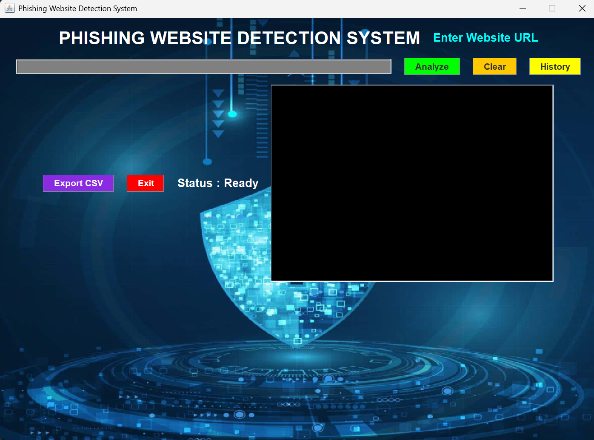
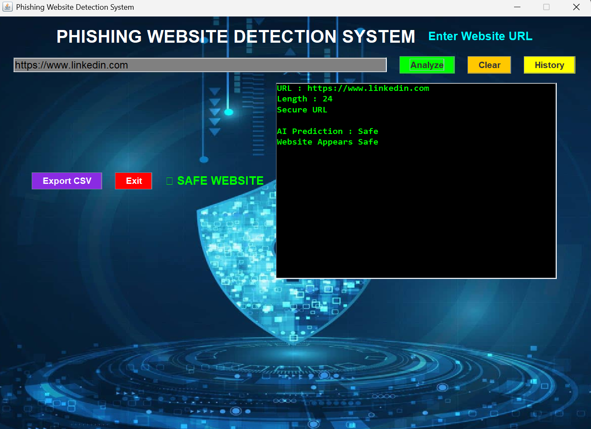
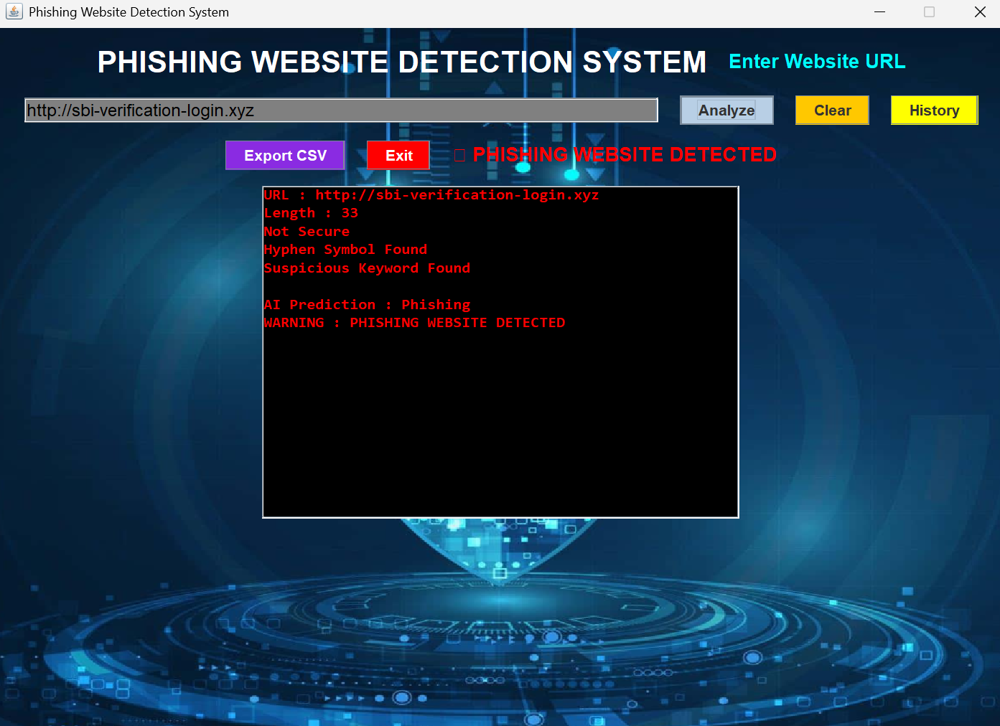
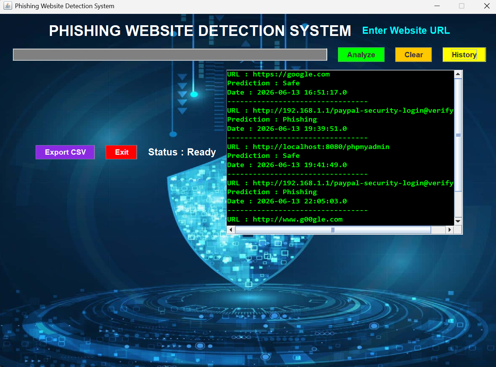
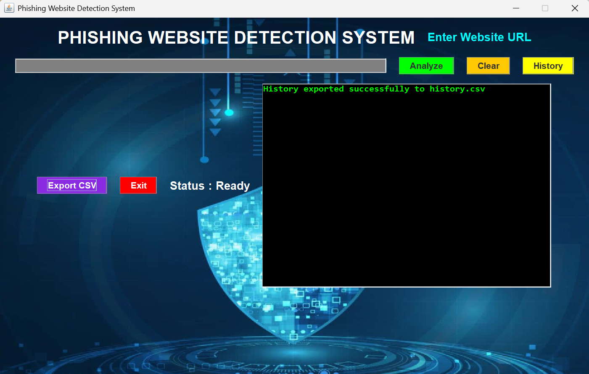
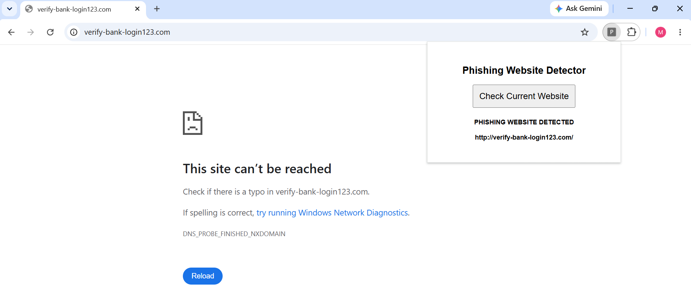

#  AI-Based Phishing Website Detection System

An intelligent phishing website detection system developed using **Java**, **Python**, **Machine Learning**, and **MySQL**. The system analyzes website URLs, extracts security-related features, predicts whether a website is safe or phishing, stores the results in a database, and provides a browser extension for quick website verification.

---

#  Project Overview

Phishing websites are designed to steal users' sensitive information such as passwords, banking credentials, and personal details.

This project uses Machine Learning along with rule-based analysis to identify suspicious websites and warn users before they become victims of phishing attacks.

---

#  Features

-  URL Analysis
-  Machine Learning Prediction
-  HTTPS Detection
-  URL Length Analysis
-  Number Detection
-  @ Symbol Detection
-  Hyphen Detection
-  Suspicious Keyword Detection
-  Phishing Score Calculation
-  MySQL Database Storage
-  History Viewer
-  Export Results to CSV
-  Browser Extension Support
-  Java Swing GUI

---

#  Technologies Used

## Programming Languages

- Java
- Python
- JavaScript
- HTML
- CSS

## Database

- MySQL

## Machine Learning

- Random Forest Classifier
- Scikit-learn
- Pandas
- Joblib

## Tools

- Visual Studio Code
- XAMPP
- Git
- GitHub

---

#  Project Structure

```
PhishingWebsiteDetectionSystem/

│
├── backend/
│
├── browser-extension/
│
├── dataset/
│
├── frontend/
│
├── images/
│
├── lib/
│
├── ml/
│
├── database/
│
├── report/
│
└── screenshots/
```

---

#  How It Works

1. User enters a website URL.
2. URL features are extracted.
3. Java performs rule-based analysis.
4. Python Machine Learning model predicts the result.
5. Phishing score is calculated.
6. Result is displayed.
7. Data is stored in MySQL.
8. User can view history.
9. User can export history as CSV.
10. Browser extension provides quick website checking.

---

#  Machine Learning Model

Algorithm Used:

- Random Forest Classifier

Features Used:

- URL Length
- HTTPS
- Numbers
- @ Symbol
- Hyphen
- Suspicious Keywords

Prediction:

- Safe Website
- Phishing Website

---

#  Installation

Clone the repository:

```bash
git clone https://github.com/Mrudhula-Thota/phishing-website-detector.git
```

Open the project in Visual Studio Code.

Install Python libraries:

```bash
pip install pandas scikit-learn joblib
```

Compile Java files:

```bash
javac *.java
```

Run the application:

```bash
java GUI
```

---

#  Screenshots

## Home Screen



---

## Safe Website Detection



---

## Phishing Website Detection



---

## History



---

## Export CSV



---

## Browser Extension



---

#  Future Enhancements

- Deep Learning Model
- Real-Time API Integration
- Cloud Deployment
- Mobile Application
- Live Website Detection
- Chrome Web Store Extension

---

#  Author

**Mrudhula Thota**

B.Tech Artificial Intelligence & Machine Learning

GitHub:

https://github.com/Mrudhula-Thota

---

#  Support

If you like this project, please give it a ⭐ on GitHub.
